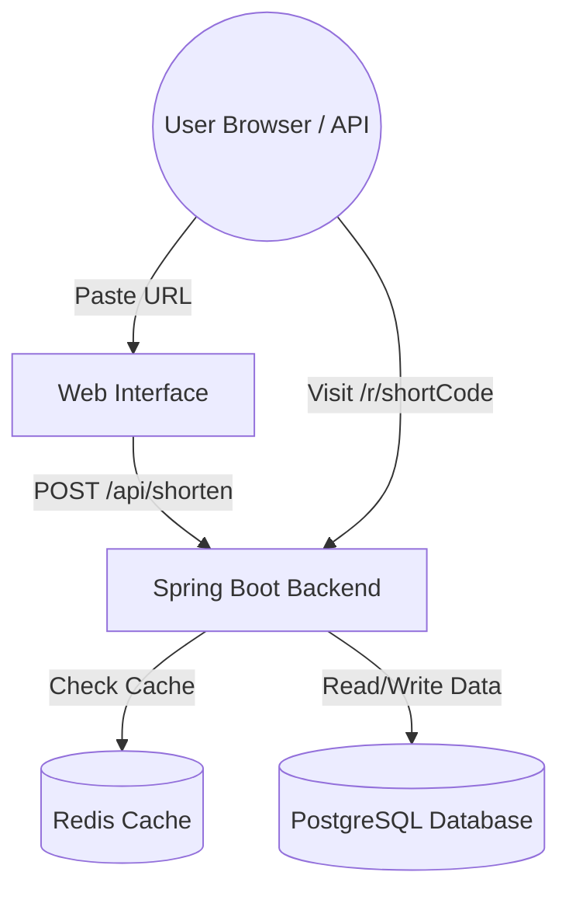

# LinkSwift - Premium URL Shortener


LinkSwift is a fast, scalable, and production-ready URL Shortener. Built with a modern glassmorphism frontend and a robust Spring Boot backend, it instantly turns your long links into manageable short codes.

## ✨ Features
- **Beautiful Web Interface:** A modern, frosted-glass UI with dynamic gradient backgrounds.
- **Blazing Fast Redirects:** Powered by a Redis caching layer to handle high traffic.
- **Robust Database:** Uses PostgreSQL as the primary datastore for reliable data persistence.
- **Click Analytics:** Tracks how many times your short links have been clicked.
- **Easy Deployment:** Includes a 1-click auto-deploy blueprint for Render.com.
- **Containerized:** Fully Dockerized for instant local setup.

---

## 🚀 How to Run Locally

Running LinkSwift on your own computer is incredibly simple using Docker. 

### Prerequisites
- [Docker Desktop](https://www.docker.com/products/docker-desktop/) installed on your machine.
- Git (optional, if you want to clone the repo).

### Step-by-Step Setup

1. **Open your terminal** and navigate to the project folder.
2. **Build and start the application:**
   ```bash
   docker-compose up -d --build
   ```
3. **Wait a few seconds** for the database and web server to initialize.
4. **Open your browser** and visit:
   ```
   http://localhost:8080/
   ```
   You should now see the beautiful LinkSwift web interface! Just paste a URL and click **Shorten**.

---

## 🌍 How to Deploy to the Cloud (Free)

We have configured a `render.yaml` blueprint to make deploying to [Render.com](https://render.com) extremely easy.

1. **Push this repository** to your own GitHub account.
2. Go to **[Render Dashboard](https://dashboard.render.com/)** and click **New +** -> **Blueprint**.
3. Select your GitHub repository.
4. Click **Apply**. Render will automatically build and deploy your PostgreSQL database and Spring Boot app.
5. **(Important) Add the Redis Cache:**
   - Go to **New +** -> **Key Value** in Render to create a free Redis instance.
   - Copy its "Internal Connection String" (starts with `rediss://...`).
   - Go to your newly deployed web service in Render, click the **Environment** tab, and add a variable:
     - **Key:** `REDIS_URL`
     - **Value:** *(Paste the connection string here)*
6. Your application will restart and be live on the internet!

---

## 💻 API Reference

If you prefer to use the API directly without the web interface, you can use these endpoints:

### 1. Shorten a URL
```bash
curl -X POST http://localhost:8080/api/shorten \
  -H "Content-Type: application/json" \
  -d "{\"originalUrl\": \"https://www.example.com/very/long/path\"}"
```
**Response:**
```json
{
  "shortUrl": "http://localhost:8080/r/000001",
  "shortCode": "000001",
  "createdAt": "2026-05-17T12:00:00"
}
```

### 2. Get Click Statistics
```bash
curl http://localhost:8080/api/stats/000001
```
**Response:**
```json
{
  "shortCode": "000001",
  "originalUrl": "https://www.example.com/very/long/path",
  "clickCount": 42,
  "createdAt": "2026-05-17T12:00:00"
}
```

---

## 🏗️ Architecture & Tech Stack

- **Backend:** Java 17, Spring Boot 3.2.x (Web, Data JPA, Cache)
- **Frontend:** Vanilla HTML/CSS/JS with Glassmorphism design
- **Database:** PostgreSQL 15
- **Cache:** Redis 7
- **Migrations:** Flyway
- **Containerization:** Docker & Docker Compose

### System Flow


### Design Decisions
- **Base62 Encoding:** We use Base62 (`0-9, a-z, A-Z`) to generate the short codes based on the auto-incremented database ID. This guarantees **collision-free**, deterministic codes that scale effortlessly.
- **Cache-Aside Pattern:** When a user visits a short link, the app checks Redis first. If it's a "Hit", it redirects instantly without touching the database. If it's a "Miss", it fetches from Postgres and saves it to Redis for the next 24 hours.
